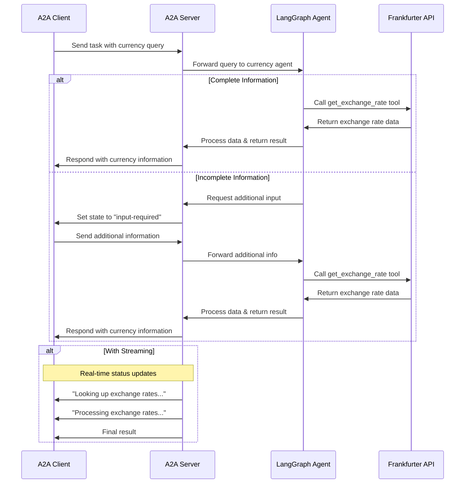

# LangGraph Currency Agent with A2A Protocol

This sample demonstrates a currency conversion agent built with [LangGraph](https://langchain-ai.github.io/langgraph/) and exposed through the A2A protocol. It showcases conversational interactions with support for multi-turn dialogue and streaming responses.

## How It Works

This agent uses LangGraph with Google Gemini to provide currency exchange information through a ReAct agent pattern. The A2A protocol enables standardized interaction with the agent, allowing clients to send requests and receive real-time updates.

## Key Features

- **Multi-turn Conversations**: Agent can request additional information when needed
- **Real-time Streaming**: Provides status updates during processing
- **Push Notifications**: Support for webhook-based notifications
- **Conversational Memory**: Maintains context across interactions
- **Currency Exchange Tool**: Integrates with Frankfurter API for real-time rates

## Technical Implementation

- **LangGraph ReAct Agent**: Uses the ReAct pattern for reasoning and tool usage
- **Streaming Support**: Provides incremental updates during processing
- **Checkpoint Memory**: Maintains conversation state between turns
- **Push Notification System**: Webhook-based updates with JWK authentication
- **A2A Protocol Integration**: Full compliance with A2A specifications

## Limitations

- Only supports text-based input/output (no multi-modal support)
- Uses Frankfurter API which has limited currency options
- Memory is session-based and not persisted between server restarts

## Learn More

- [A2A Protocol Documentation](https://google.github.io/A2A/#/documentation)
- [LangGraph Documentation](https://langchain-ai.github.io/langgraph/)
- [Frankfurter API](https://www.frankfurter.app/docs/)
- [Google Gemini API](https://ai.google.dev/gemini-api)
