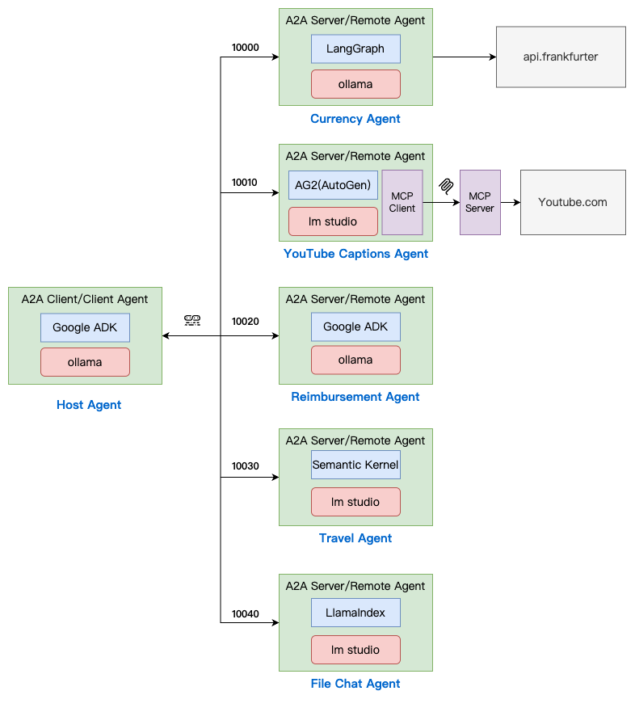

# A2A Python Example with Ollama Integration

This project demonstrates a complete A2A ecosystem where different AI frameworks work together:

- **Travel Agent** (Semantic Kernel) orchestrates complex travel planning by calling other agents
- **Currency Agent** (LangGraph) provides real-time currency conversion services
- **YouTube Agent** (AG2+MCP) extracts video content for travel research
- **Reimbursement Agent** (Google ADK) handles expense workflows with forms
- **File Chat Agent** (LlamaIndex) enables document-based conversations with file uploads

🎯 **Key Achievement**: Real cross-agent communication using A2A JSON-RPC protocol with local LLMs!



## Project Structure

```sh
hello-a2a-python/
├── requirements.txt          # All dependencies managed via pip
├── hosts/                    # Host applications
│   ├── cli/                 # CLI host (simplified, no push notifications)
│   └── webui/               # Web UI host
│       ├── frontend/        # Frontend application
│       └── backend/         # Web UI backend
└── remotes/                  # Remote agent implementations
    ├── langgraph/           # LangGraph agent
    ├── ag2/                 # AG2 agent
    ├── google_adk/          # Google ADK agent
    ├── semantickernel/      # Semantic Kernel agent
    └── llama_index_file_chat/ # LlamaIndex agent
```

## Prerequisites

Create and activate a virtual environment:

```bash
python -m venv venv
source venv/bin/activate
# On Windows:
venv\Scripts\activate
```

Install dependencies:

```bash
pip install -r requirements.txt
```

### Local LLM Services

| Service       | Installation                              | Verification                                                     |
| ------------- | ----------------------------------------- | ---------------------------------------------------------------- |
| **Ollama**    | [Download](https://ollama.com/install.sh) | `curl -s http://localhost:11434/api/tags \| jq '.models[].name'` |
| **LM Studio** | [Download](https://lmstudio.ai/)          | `curl -s http://localhost:1234/v1/models \| jq '.data[].id'`     |

## Remote & Host Agent List

| Agent                   | Framework       | Port  | Purpose                              |
| :---------------------- | :-------------- | :---- | :----------------------------------- |
| **Currency Agent**      | LangGraph       | 10000 | Real-time currency conversion        |
| **YouTube Agent**       | AG2 + MCP       | 10010 | Video transcript analysis            |
| **Reimbursement Agent** | Google ADK      | 10020 | Expense processing with forms        |
| **Travel Agent**        | Semantic Kernel | 10030 | Trip planning with currency          |
| **File Chat Agent**     | LlamaIndex      | 10040 | Document parsing & Q&A               |
| **Host Agent**          | Google ADK      | -     | Task orchestration & agent selection |

## Remote Agents

### 1 Currency Agent

#### Langgraph API

<https://python.langchain.com/docs/integrations/providers/openai/>

`remotes/langgraph/agent.py`

```python
class CurrencyAgent:
    self.model = ChatOpenAI(
        model=model_name,
        base_url=base_url,
    )
```

#### Tools of Currency Agent

[frankfurter](https://github.com/lineofflight/frankfurter)

```sh
http -b https://api.frankfurter.dev/v1/currencies
```

```sh
http -b "https://api.frankfurter.dev/v1/latest?from=USD&to=CNY&amount=100"
http -b "https://api.frankfurter.app/latest?from=USD&to=CNY&amount=100"
```

#### Start Currency Agent

```bash
# With LM Studio
./start_remote_agent.sh langgraph --host localhost --port 10000 --llm-provider lmstudio --model-name qwen3-8b
# With Ollama
./start_remote_agent.sh langgraph --host localhost --port 10000 --llm-provider ollama --model-name qwen3:8b
```

Windows

```bash
# With LM Studio
.\start_remote_agent.ps1 langgraph --host localhost --port 10000 --llm-provider lmstudio --model-name qwen3-8b
# With Ollama
.\start_remote_agent.ps1 langgraph --host localhost --port 10000 --llm-provider ollama --model-name qwen3:8b
```

#### Agent Card of Currency Agent

```bash
http --body http://localhost:10000/.well-known/agent.json

Invoke-RestMethod -Uri "http://localhost:10000/.well-known/agent.json"
```

```json
{
  "capabilities": {
    "pushNotifications": true,
    "streaming": true
  },
  "defaultInputModes": ["text", "text/plain"],
  "defaultOutputModes": ["text", "text/plain"],
  "description": "Helps with exchange rates for currencies",
  "name": "Currency Agent",
  "skills": [
    {
      "description": "Helps with exchange values between various currencies",
      "examples": ["What is exchange rate between USD and GBP?"],
      "id": "convert_currency",
      "name": "Currency Exchange Rates Tool",
      "tags": ["currency conversion", "currency exchange"]
    }
  ],
  "url": "http://localhost:10000/",
  "version": "1.0.0"
}
```

#### User Case of Currency Agent

```bash
http POST localhost:10000 \
  Content-Type:application/json \
  jsonrpc="2.0" \
  id:=1 \
  method="message/send" \
  params:='{
    "id": "129",
    "sessionId": "test-session",
    "acceptedOutputModes": ["text"],
    "message": {
      "messageId": "msg-01",
      "role": "user",
      "parts": [{
        "type": "text",
        "text": "Convert 100 USD to CNY"
      }]
    }
  }' | jq '.result.artifacts'
```

windows

```bash
$body = @'
{
  "jsonrpc": "2.0",
  "id": 1,
  "method": "message/send",
  "params": {
    "id": "129",
    "sessionId": "test-session",
    "acceptedOutputModes": ["text"],
    "message": {
      "messageId": "msg-01",
      "role": "user",
      "parts": [{
        "type": "text",
        "text": "Convert 100 USD to CNY"
      }]
    }
  }
}
'@

$response = Invoke-RestMethod -Uri "http://localhost:10000" -Method POST -ContentType "application/json" -Body $body
$response.result.artifacts
```

```json
[
  {
    "artifactId": "768abfc3-5c22-46e4-aed0-c51c020b8b9e",
    "name": "conversion_result",
    "parts": [
      {
        "kind": "text",
        "text": "2025-06-05: 100.0 USD = 717.92 CNY (Exchange Rate: 1 USD = 7.1792 CNY)"
      }
    ]
  }
]
```

### 2 YouTube Agent

#### AG2(AutoGen) API

- <https://docs.ag2.ai/latest/docs/user-guide/models/lm-studio/>
- <https://docs.ag2.ai/latest/docs/user-guide/models/ollama/>

`remotes/ag2/agent.py`

```python
class YoutubeMCPAgent:
  llm_config = LLMConfig(
      model="qwen3-8b",
      api_type="openai",
      base_url="http://localhost:1234/v1",
      api_key="lm-studio"
  )

  llm_config = LLMConfig(
      model="qwen3:8b",
      api_type="ollama",
      client_host="http://localhost:11434",
  )

  self.agent = AssistantAgent(
      name='YoutubeMCPAgent',
      llm_config=llm_config,
  )
```

#### Mcp Server of YouTube Agent

<https://github.com/sparfenyuk/mcp-youtube>

```bash
uv tool install git+https://github.com/sparfenyuk/mcp-youtube
$HOME/.local/share/uv/tools/mcp-youtube/bin/mcp-youtube --help
```

#### Start YouTube Agent

```bash
# With LM Studio (default)
./start_remote_agent.sh ag2 --host localhost --port 10010 --llm-provider lmstudio --model-name qwen3-30b-a3b
# With Ollama
./start_remote_agent.sh ag2 --host localhost --port 10010 --llm-provider ollama --model-name qwen3:30b-a3b
```

Windows

```bash
# With LM Studio
.\start_remote_agent.ps1 ag2 --host localhost --port 10010 --llm-provider lmstudio --model-name qwen3-30b-a3b
# With Ollama
.\start_remote_agent.ps1 ag2 --host localhost --port 10010 --llm-provider ollama --model-name qwen3:30b-a3b
```

#### Agent Card of YouTube Agent

```bash
http -b http://localhost:10010/.well-known/agent.json

Invoke-RestMethod -Uri "http://localhost:10010/.well-known/agent.json"
```

```json
{
  "capabilities": {
    "streaming": true
  },
  "defaultInputModes": ["text", "text/plain"],
  "defaultOutputModes": ["text", "text/plain"],
  "description": "AI agent that can extract closed captions and transcripts from YouTube videos. This agent provides raw transcription data that can be used for further processing.",
  "name": "YouTube Captions Agent",
  "skills": [
    {
      "description": "Retrieve closed captions/transcripts from YouTube videos",
      "examples": [
        "Extract the transcript from this YouTube video: https://www.youtube.com/watch?v=xxxxxx",
        "Download the captions for this YouTube tutorial"
      ],
      "id": "download_closed_captions",
      "name": "Download YouTube Closed Captions",
      "tags": ["youtube", "captions", "transcription", "video"]
    }
  ],
  "url": "http://localhost:10010/",
  "version": "1.0.0"
}
```

#### User Case of YouTube Agent

```bash
http -b POST localhost:10010 \
  Content-Type:application/json \
  jsonrpc="2.0" \
  id:=1 \
  method="message/send" \
  params:='{
    "id": "921",
    "sessionId": "test-session",
    "acceptedOutputModes": ["text"],
    "message": {
      "messageId": "msg-01",
      "role": "user",
      "parts": [{
        "type": "text",
        "text": "Please download the captions from this YouTube video and provide a summary based on the content: https://www.youtube.com/watch?v=4pYzYmSdSH4"
      }]
    }
  }'| jq '.result.artifacts'
```

Windows

```bash
$body = @'
{
  "jsonrpc": "2.0",
  "id": 1,
  "method": "message/send",
  "params": {
    "id": "921",
    "sessionId": "test-session",
    "acceptedOutputModes": ["text"],
    "message": {
      "messageId": "msg-01",
      "role": "user",
      "parts": [{
        "type": "text",
        "text": "Please download the captions from this YouTube video and provide a summary based on the content: https://www.youtube.com/watch?v=4pYzYmSdSH4"
      }]
    }
  }
}
'@

$response = Invoke-RestMethod -Uri "http://localhost:10010" -Method POST -ContentType "application/json" -Body $body
$response.result.artifacts
```

```json
[
  {
    "artifactId": "a4b4e4a8-7900-4cb5-b6c0-a5ab3602df20",
    "description": "智能体请求的结果。",
    "name": "current_result",
    "parts": [
      {
        "kind": "text",
        "text": "{\n  \"text_reply\": \"Here are the captions for the YouTube video along with a summary of the content: The discussion covers advancements in multi-agent systems, where collaboration between different teams' AI agents remains challenging but promising. It addresses 'vibe coding' as a growing practice using AI tools to enhance productivity, though it requires technical understanding despite its name. The speaker also shares insights on starting AI-funded startups, emphasizing speed, technical expertise, and the importance of combining business acumen with deep technology knowledge.\",\n  \"closed_captions\": \"[Captions downloaded successfully]\"\n}"
      }
    ]
  }
]
```

### 3 Reimbursement Agent

#### Google ADK API

- <https://google.github.io/adk-docs/agents/models/#using-ollama_chat_provider>
- <https://google.github.io/adk-docs/agents/models/#using-openai-provider>

`remotes/google_adk/agent.py`

```python
class ReimbursementAgent(AgentWithTaskManager):
    return LlmAgent(
        model=LiteLlm(
            model="openai/qwen3-8b",
            api_base="http://localhost:1234/v1",
            api_key="lm-studio"
        ),
    )
```

#### Start Reimbursement Agent

```bash
export GOOGLE_GENAI_USE_VERTEXAI=TRUE
# With LM Studio (default)
./start_remote_agent.sh google_adk --host localhost --port 10020 --llm-provider lmstudio --model-name qwen3-8b
# With Ollama
./start_remote_agent.sh google_adk --host localhost --port 10020 --llm-provider ollama --model-name qwen3:8b
```

Windows

```bash
$env:GOOGLE_GENAI_USE_VERTEXAI = "TRUE"
# With LM Studio
.\start_remote_agent.ps1 google_adk --host localhost --port 10020 --llm-provider lmstudio --model-name qwen3-8b
# With Ollama
.\start_remote_agent.ps1 google_adk --host localhost --port 10020 --llm-provider ollama --model-name qwen3:8b
```

#### Agent Card of Reimbursement Agent

```bash
http -b http://localhost:10020/.well-known/agent.json

Invoke-RestMethod -Uri "http://localhost:10020/.well-known/agent.json"
```

```json
{
  "capabilities": {
    "streaming": true
  },
  "defaultInputModes": ["text", "text/plain"],
  "defaultOutputModes": ["text", "text/plain"],
  "description": "This agent handles the reimbursement process for the employees given the amount and purpose of the reimbursement.",
  "name": "Reimbursement Agent",
  "skills": [
    {
      "description": "Helps with the reimbursement process for users given the amount and purpose of the reimbursement.",
      "examples": ["Can you reimburse me $20 for my lunch with the clients?"],
      "id": "process_reimbursement",
      "name": "Process Reimbursement Tool",
      "tags": ["reimbursement"]
    }
  ],
  "url": "http://localhost:10020/",
  "version": "1.0.0"
}
```

#### User Case of Reimbursement Agent

The reimbursement agent validates request IDs against predefined formats. Use one of these valid request IDs:

- `REQ-2024-0601-001`
- `REQ-2024-0601-002`
- `REQ-2024-0601-003`
- `REQ-2024-0602-001`

**1. New Expense Report Request:**

```bash
curl -X POST http://localhost:10020/ \
  -H "Content-Type: application/json" \
  -d '{
    "id": "test-123",
    "method": "message/send",
    "params": {
      "messageId": "msg-456",
      "message": {
        "messageId": "msg-456",
        "role": "user",
        "parts": [
          {
            "text": "请帮我提交一个报销申请，我需要报销出差的交通费用500元"
          }
        ]
      }
    }
  }'
```

**Response:** Agent returns a form with schema and pre-filled data:

```json
{
  "status": {
    "state": "input-required",
    "message": {
      "parts": [
        {
          "data": {
            "form": {
              "type": "object",
              "properties": {
                "date": {
                  "type": "string",
                  "format": "date",
                  "description": "费用日期"
                },
                "amount": {
                  "type": "string",
                  "format": "number",
                  "description": "费用金额"
                },
                "purpose": { "type": "string", "description": "费用目的" },
                "request_id": { "type": "string", "description": "申请ID" }
              },
              "required": ["date", "amount", "purpose"]
            },
            "form_data": {
              "date": "<交差日期>",
              "amount": "500",
              "purpose": "出差的交通费用"
            },
            "instructions": "请确认并补充完整表单信息：1. 交易日期 2. 金额(已填写500) 3. 业务理由(已填写出差的交通费用)"
          }
        }
      ]
    }
  }
}
```

**2. Form Submission:**

```bash
curl -X POST http://localhost:10020/ \
  -H "Content-Type: application/json" \
  -d '{
    "id": "test-form-submit",
    "method": "message/send",
    "params": {
      "messageId": "msg-form-submit",
      "message": {
        "messageId": "msg-form-submit",
        "role": "user",
        "parts": [
          {
            "text": "Form completed: Date: 2024-06-01, Amount: 500, Purpose: Business trip transportation costs, Request ID: REQ-2024-0601-001"
          }
        ]
      }
    }
  }'
```

Windows

```powershell
$body = @'
{
  "id": "test-form-submit",
  "method": "message/send",
  "params": {
    "messageId": "msg-form-submit",
    "message": {
      "messageId": "msg-form-submit",
      "role": "user",
      "parts": [
        {
          "text": "Form completed: Date: 2024-06-01, Amount: 500, Purpose: Business trip transportation costs, Request ID: REQ-2024-0601-001"
        }
      ]
    }
  }
}
'@

$response = Invoke-RestMethod -Uri "http://localhost:10020/" -Method POST -ContentType "application/json" -Body $body
$response.result.status
```

**Response:** Agent processes and completes the expense report:

```json
{
  "status": {
    "state": "completed"
  },
  "artifacts": [
    {
      "name": "response",
      "parts": [
        {
          "text": "您的报销申请已成功处理！\n✅ 申请ID: REQ-2024-0601-001\n✅ 状态: 已批准\n金额: $500\n业务目的: Business trip transportation costs\n\n请注意查收报销款项，如有任何疑问请随时联系财务部门。"
        }
      ]
    }
  ]
}
```

**2. Invalid Request ID Example:**

```bash
curl -X POST http://localhost:10020/ \
  -H "Content-Type: application/json" \
  -d '{
    "id": "test-invalid-id",
    "method": "message/send",
    "params": {
      "messageId": "msg-invalid",
      "message": {
        "messageId": "msg-invalid",
        "role": "user",
        "parts": [
          {
            "text": "Form completed: Date: 2024-06-01, Amount: 500, Purpose: Business trip, Request ID: REQ001"
          }
        ]
      }
    }
  }'
```

**Response:** Agent returns form with validation error:

```json
{
  "status": {
    "state": "input-required",
    "message": {
      "parts": [
        {
          "data": {
            "instructions": "错误：所提供的请求ID无效。请提供符合格式要求的申请ID，例如：REQ-20240601-001。"
          }
        }
      ]
    }
  }
}
```

### 4 Travel Agent

#### Semantic Kernel API

- <https://learn.microsoft.com/en-us/semantic-kernel/overview/>

`remotes/semantickernel/agent.py`

```python
class SemanticKernelTravelAgent:
    openai_client = openai.AsyncOpenAI(
        api_key=api_key,
        base_url=base_url
    )
    currency_exchange_agent = ChatCompletionAgent(
        service=OpenAIChatCompletion(
            ai_model_id=model_id,
            api_key=api_key,
            async_client=openai_client
        )
    )
    activity_planner_agent = ChatCompletionAgent(
        service=OpenAIChatCompletion(
            ai_model_id=model_name,
            api_key=api_key,
            async_client=openai_client
        )
    )
    self.agent = ChatCompletionAgent(
        service=OpenAIChatCompletion(
            ai_model_id=model_name,
            api_key=api_key,
            async_client=openai_client
        ),
        plugins=[currency_exchange_agent, activity_planner_agent]

```

#### Start Travel Agent

```bash
# With LM Studio (default)
./start_remote_agent.sh semantickernel --host localhost --port 10030 --llm-provider lmstudio --model-name qwen3-30b-a3b
# With Ollama
./start_remote_agent.sh semantickernel --host localhost --port 10030 --llm-provider ollama --model-name qwen3:30b-a3b
```

Windows

```bash
# With LM Studio
.\start_remote_agent.ps1 semantickernel --host localhost --port 10030 --llm-provider lmstudio --model-name qwen3-30b-a3b
# With Ollama
.\start_remote_agent.ps1 semantickernel --host localhost --port 10030 --llm-provider ollama --model-name qwen3:30b-a3b
```

#### Agent Card of Travel Agent

```bash
http --body http://localhost:10030/.well-known/agent.json

Invoke-RestMethod -Uri "http://localhost:10030/.well-known/agent.json"
```

```json
{
  "capabilities": {
    "streaming": true
  },
  "defaultInputModes": ["text"],
  "defaultOutputModes": ["text"],
  "description": "Semantic Kernel-based travel agent providing comprehensive trip planning services including currency exchange and personalized activity planning.",
  "name": "SK Travel Agent",
  "skills": [
    {
      "description": "Handles comprehensive trip planning, including currency exchanges, itinerary creation, sightseeing, dining recommendations, and event bookings using Frankfurter API for currency conversions.",
      "examples": [
        "Plan a budget-friendly day trip to Seoul including currency exchange.",
        "What's the exchange rate and recommended itinerary for visiting Tokyo?"
      ],
      "id": "trip_planning_sk",
      "name": "Semantic Kernel Trip Planning",
      "tags": ["trip", "planning", "travel", "currency", "semantic-kernel"]
    }
  ],
  "url": "http://localhost:10030/",
  "version": "1.0.0"
}
```

#### User Case of Travel Agent

**Testing Travel Agent with Multi-Agent Integration:**

```bash
http --stream POST localhost:10030 \
  Content-Type:application/json \
  jsonrpc="2.0" \
  id:=1 \
  method="message/send" \
  params:='{
    "id": "travel-korea-plan",
    "sessionId": "test-session",
    "acceptedOutputModes": ["text"],
    "streaming": true,
    "message": {
      "messageId": "msg-01",
      "role": "user",
      "parts": [{
        "type": "text",
        "text": "I have a budget of 5,000 US dollars and want to travel to Seoul, South Korea for 7 days. Please help me make a detailed travel plan, including exchange rate conversion and specific itinerary arrangements."
      }]
    }
  }'
```

Windows

```bash
$body = @'
{
  "jsonrpc": "2.0",
  "id": 1,
  "method": "message/send",
  "params": {
    "id": "travel-korea-plan",
    "sessionId": "test-session",
    "acceptedOutputModes": ["text"],
    "streaming": true,
    "message": {
      "messageId": "msg-01",
      "role": "user",
      "parts": [{
        "type": "text",
        "text": "I have a budget of 5,000 US dollars and want to travel to Seoul, South Korea for 7 days. Please help me make a detailed travel plan, including exchange rate conversion and specific itinerary arrangements."
      }]
    }
  }
}
'@

$response = Invoke-RestMethod -Uri "http://localhost:10030" -Method POST -ContentType "application/json" -Body $body
$response.result.artifacts
```

**Response with Multi-Agent Collaboration:**

```json
{
  "id": 1,
  "jsonrpc": "2.0",
  "result": {
    "artifacts": [
      {
        "artifactId": "travel-plan-korea",
        "name": "seoul_travel_plan",
        "parts": [
          {
            "kind": "text",
            "text": "# 📍 首尔7天详细旅行计划\n\n## 💰 预算与汇率信息\n- **总预算**: 5000 USD\n- **当前汇率**: 1 USD = 1376.78 KRW\n- **韩元预算**: 约 6,883,900 KRW\n\n## 🗓️ 详细行程安排\n\n### Day 1: 抵达首尔 (预算: 800,000 KRW)\n- **住宿**: 明洞地区酒店 (120,000 KRW/晚)\n- **交通**: 仁川机场快线 → 明洞 (9,000 KRW)\n- **晚餐**: 明洞街头美食体验 (30,000 KRW)\n- **活动**: 明洞购物街漫步，适应时差\n\n### Day 2: 宫殿文化之旅 (预算: 150,000 KRW)\n- **景点**: 景福宫 + 昌德宫 (门票: 8,000 KRW)\n- **体验**: 韩服租赁体验 (20,000 KRW)\n- **午餐**: 仁寺洞传统韩式料理 (25,000 KRW)\n- **下午**: 北村韩屋村 + 三清洞咖啡街\n- **晚餐**: 弘大韩式烤肉 (40,000 KRW)\n\n### Day 3: 现代首尔体验 (预算: 200,000 KRW)\n- **上午**: 乐天世界塔 + 天空步道 (门票: 27,000 KRW)\n- **午餐**: 江南区精致餐厅 (50,000 KRW)\n- **下午**: 江南COEX购物中心 + 星空图书馆\n- **晚上**: 汉江公园野餐 + 夜景 (15,000 KRW)\n\n### Day 4: 传统市场与美食 (预算: 120,000 KRW)\n- **上午**: 广藏市场传统美食巡礼 (30,000 KRW)\n- **中午**: 东大门设计广场 (DDP)\n- **下午**: 梨泰院国际街区 (25,000 KRW)\n- **晚餐**: 新村大学路韩式炸鸡配啤酒 (25,000 KRW)\n\n### Day 5: 自然与休闲 (预算: 100,000 KRW)\n- **全天**: 南山首尔塔 + 缆车 (门票: 21,000 KRW)\n- **午餐**: 南山韩屋村餐厅 (30,000 KRW)\n- **下午**: 汝矣岛汉江公园骑行 (自行车租赁: 10,000 KRW)\n- **晚餐**: 汝矣岛夜市小吃 (20,000 KRW)\n\n### Day 6: 购物与娱乐 (预算: 300,000 KRW)\n- **上午**: 明洞乐天免税店购物 (200,000 KRW)\n- **午餐**: 明洞韩式拌饭专门店 (15,000 KRW)\n- **下午**: 弘大Club + K-POP体验馆 (30,000 KRW)\n- **晚餐**: 弘大大学路聚餐 (35,000 KRW)\n\n### Day 7: 离别首尔 (预算: 50,000 KRW)\n- **上午**: 仁寺洞纪念品购买 (30,000 KRW)\n- **午餐**: 机场简餐 (15,000 KRW)\n- **交通**: 明洞 → 仁川机场 (9,000 KRW)\n\n## 🏨 住宿推荐 (7晚 × 120,000 KRW = 840,000 KRW)\n- **明洞乐天酒店** 或 **首尔明洞九树酒店**\n- 位置优越，交通便利，购物方便\n\n## 🚌 交通费用总计: 约 100,000 KRW\n- 地铁7日通票: 53,200 KRW\n- 机场快线往返: 18,000 KRW\n- 市内出租车: 30,000 KRW\n\n## 💵 总费用明细 (KRW)\n- **住宿**: 840,000\n- **餐饮**: 315,000\n- **交通**: 100,000\n- **景点门票**: 84,000\n- **购物娱乐**: 530,000\n- **其他杂费**: 100,000\n- **总计**: 1,969,000 KRW (约 1,430 USD)\n\n## ✅ 预算充足提示\n剩余预算约 3,570 USD，可以:\n- 升级住宿至五星级酒店\n- 增加购物预算\n- 体验更多高端餐厅\n- 考虑济州岛1-2日游\n\n## 📱 实用信息\n- **天气**: 春季(15-20°C) 夏季(25-30°C)\n- **必备APP**: 지하철(地铁), 카카오맵(地图)\n- **语言**: 下载翻译APP，基础韩语学习\n- **网络**: 租赁随身WiFi或购买当地SIM卡\n\n🎉 **祝您首尔之旅愉快！**"
          }
        ]
      }
    ],
    "status": {
      "state": "completed"
    }
  }
}
```

### 5 File Chat Agent

#### LlamaIndex API

- <https://docs.llamaindex.ai/en/stable/examples/llm/ollama/>
- <https://docs.llamaindex.ai/en/stable/examples/llm/lmstudio/>

`remotes/llama_index_file_chat/agent.py`

```python
class ParseAndChat(Workflow):
    self._sllm = OpenAI(
        model=model_name,
        base_url="http://localhost:1234/v1",
    )
```

#### Start File Chat Agent

```bash
# With LM Studio
./start_remote_agent.sh llama_index_file_chat --host localhost --port 10040 --llm-provider lmstudio --model-name qwen3-30b-a3b
# With Ollama
./start_remote_agent.sh llama_index_file_chat --host localhost --port 10040 --llm-provider ollama --model-name qwen3:30b-a3b
```

Windows

```bash
# With LM Studio
.\start_remote_agent.ps1 llama_index_file_chat --host localhost --port 10040 --llm-provider lmstudio --model-name qwen3-30b-a3b
# With Ollama
.\start_remote_agent.ps1 llama_index_file_chat --host localhost --port 10040 --llm-provider ollama --model-name qwen3:30b-a3b
```

#### Agent Card of File Chat Agent

```bash
http --body http://localhost:10040/.well-known/agent.json

Invoke-RestMethod -Uri "http://localhost:10040/.well-known/agent.json"
```

```json
{
  "capabilities": {
    "pushNotifications": true,
    "streaming": true
  },
  "defaultInputModes": [
    "text/plain",
    "application/pdf",
    "application/msword",
    "image/png",
    "image/jpeg"
  ],
  "defaultOutputModes": ["text", "text/plain"],
  "description": "Parses a file and then chats with a user using the parsed content as context.",
  "name": "Parse and Chat",
  "skills": [
    {
      "description": "Parses a file and then chats with a user using the parsed content as context.",
      "examples": ["What does this file talk about?"],
      "id": "parse_and_chat",
      "name": "Parse and Chat",
      "tags": ["parse", "chat", "file", "llama_parse"]
    }
  ],
  "url": "http://localhost:10040/",
  "version": "1.0.0"
}
```

#### User Case of File Chat Agent

```bash
export DOC_PATH=test_file
export DOC_BASE64=$(base64 -i $DOC_PATH)

http POST localhost:10040 \
  Content-Type:application/json \
  jsonrpc="2.0" \
  id:=2 \
  method="message/send" \
  params:="{
    \"id\": \"file-analysis-test\",
    \"sessionId\": \"file-chat-session\",
    \"acceptedOutputModes\": [\"text\"],
    \"message\": {
      \"messageId\": \"msg-file-01\",
      \"role\": \"user\",
      \"parts\": [
        {
          \"type\": \"text\",
          \"text\": \"请分析并总结这个文档\"
        },
        {
          \"type\": \"file\",
          \"file\": {
            \"name\": \"ai_document.txt\",
            \"mimeType\": \"text/plain\",
            \"bytes\": \"$DOC_BASE64\"
          }
        }
      ]
    }
  }" | jq '.result.artifacts'

$DOC_PATH = "test_file"
$DOC_BASE64 = [Convert]::ToBase64String([IO.File]::ReadAllBytes($DOC_PATH))

$body = @"
{
  "jsonrpc": "2.0",
  "id": 2,
  "method": "message/send",
  "params": {
    "id": "file-analysis-test",
    "sessionId": "file-chat-session",
    "acceptedOutputModes": ["text"],
    "message": {
      "messageId": "msg-file-01",
      "role": "user",
      "parts": [
        {
          "type": "text",
          "text": "Summarize the doc"
        },
        {
          "type": "file",
          "file": {
            "name": "ai_document.txt",
            "mimeType": "text/plain",
            "bytes": "$DOC_BASE64"
          }
        }
      ]
    }
  }
}
"@

$response = Invoke-RestMethod -Uri "http://localhost:10040" -Method POST -ContentType "application/json" -Body $body
$response.result.artifacts
```

```json
[
  {
    "artifactId": "f427dc45-f27e-4bf5-9df4-b62e170e7ec8",
    "metadata": {},
    "name": "llama_summary",
    "parts": [
      {
        "kind": "text",
        "text": "..."
      }
    ]
  }
]
```

## Cli

```bash
./start_cli.sh --agent http://localhost:10000

Convert 100 USD to CNY
```

```bash
Task status: completed

2025-06-02: 100.0 USD = 719.98 CNY (1 USD = 7.1998 CNY)
```

## Host Agent Cli

```bash
$ echo "Convert 100 USD to CNY\nquit" | python -m hosts.cli.host_agent_cli

🔧 Manual mode: Agents should be started separately
📋 Registered agent: Currency Agent
   Description: Helps with exchange rates for currencies
   URL: http://localhost:10000
📋 Registered agent: YouTube Captions Agent
   Description: AI agent that can extract closed captions and transcripts from YouTube videos. This agent provides raw transcription data that can be used for further processing.
   URL: http://localhost:10010
📋 Registered agent: Reimbursement Agent
   Description: This agent handles the reimbursement process for the employees given the amount and purpose of the reimbursement.
   URL: http://localhost:10020
📋 Registered agent: SK Travel Agent
   Description: Semantic Kernel-based travel agent providing comprehensive trip planning services including currency exchange and personalized activity planning.
   URL: http://localhost:10030
📋 Registered agent: Parse and Chat
   Description: Parses a file and then chats with a user using the parsed content as context.
   URL: http://localhost:10040

🎉 Host Agent CLI Ready!
As a host agent, I can help you communicate with remote agents.
Type your queries below. Type 'quit' or ':q' to exit.
Type 'agents' to list available remote agents.
------------------------------------------------------------

💬 Your query:
🤔 Analyzing query: 'Convert 100 USD to CNY'
🔍 Available agents:
   - Currency Agent: Helps with exchange rates for currencies
   - YouTube Captions Agent: AI agent that can extract closed captions and transcripts from YouTube videos. This agent provides raw transcription data that can be used for further processing.
   - Reimbursement Agent: This agent handles the reimbursement process for the employees given the amount and purpose of the reimbursement.
   - SK Travel Agent: Semantic Kernel-based travel agent providing comprehensive trip planning services including currency exchange and personalized activity planning.
   - Parse and Chat: Parses a file and then chats with a user using the parsed content as context.
🎯 Selected agent: Currency Agent
📤 Sending message to Currency Agent...
🌊 Using streaming communication...
📨 Received event type: Task

📋 Currency Agent task:
   Task ID: ceecbc9a-a27a-43b0-b92e-12199c2ade6c
   Status: TaskState.submitted
📨 Received event type: TaskStatusUpdateEvent
   📊 Task Status Update: message=Message(contextId='bc8fed4b-f360-491b-b133-6b7eb376a476', kind='message', messageId='d4e9e7d0-4736-47e3-bd61-7c25bdeca8b5', metadata=None, parts=[Part(root=TextPart(kind='text', metadata=None, text='正在查询汇率...'))], referenceTaskIds=None, role=<Role.agent: 'agent'>, taskId='ceecbc9a-a27a-43b0-b92e-12199c2ade6c') state=<TaskState.working: 'working'> timestamp=None
📨 Received event type: TaskStatusUpdateEvent
   📊 Task Status Update: message=Message(contextId='bc8fed4b-f360-491b-b133-6b7eb376a476', kind='message', messageId='b9143c01-f7c8-45d5-b3c4-664691890e78', metadata=None, parts=[Part(root=TextPart(kind='text', metadata=None, text='正在处理汇率数据...'))], referenceTaskIds=None, role=<Role.agent: 'agent'>, taskId='ceecbc9a-a27a-43b0-b92e-12199c2ade6c') state=<TaskState.working: 'working'> timestamp=None
📨 Received event type: TaskArtifactUpdateEvent
   📎 Task Artifact Update: Unknown
      Artifact: conversion_result
         Content: 2025-06-05: 100.0 USD = 717.92 CNY (Exchange Rate: 1 USD = 7.1792 CNY)
📨 Received event type: TaskStatusUpdateEvent
   📊 Task Status Update: message=None state=<TaskState.completed: 'completed'> timestamp=None
```

## Host Agent WebUI

```bash
./start_host_agent.sh
```

<http://localhost:12000>
